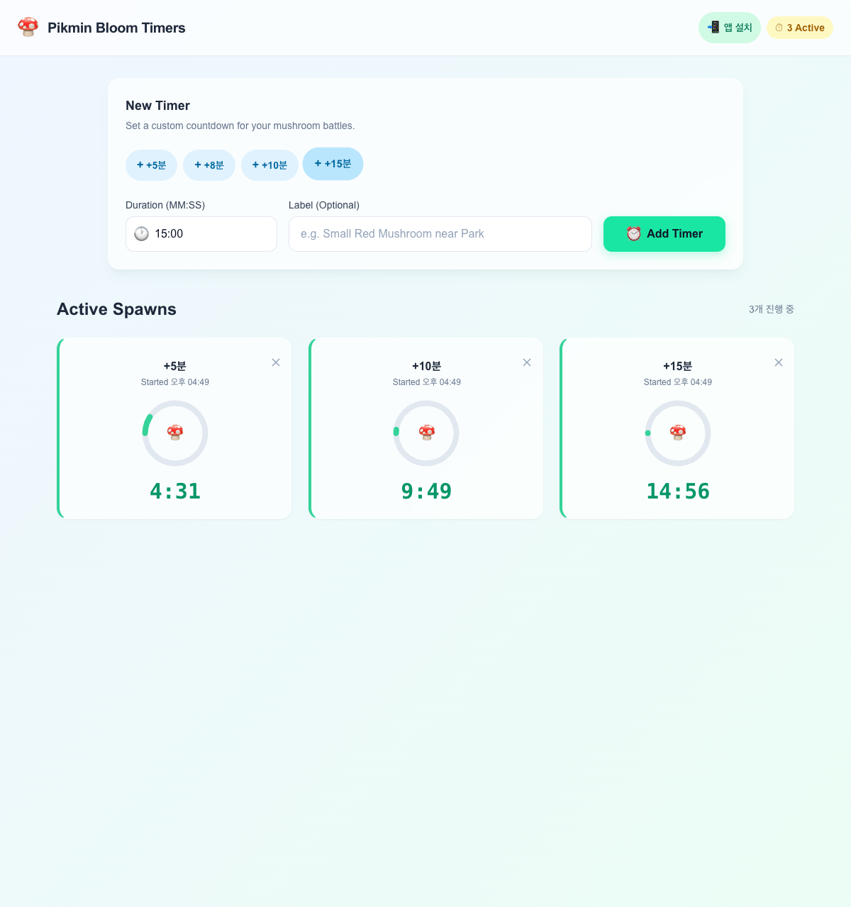
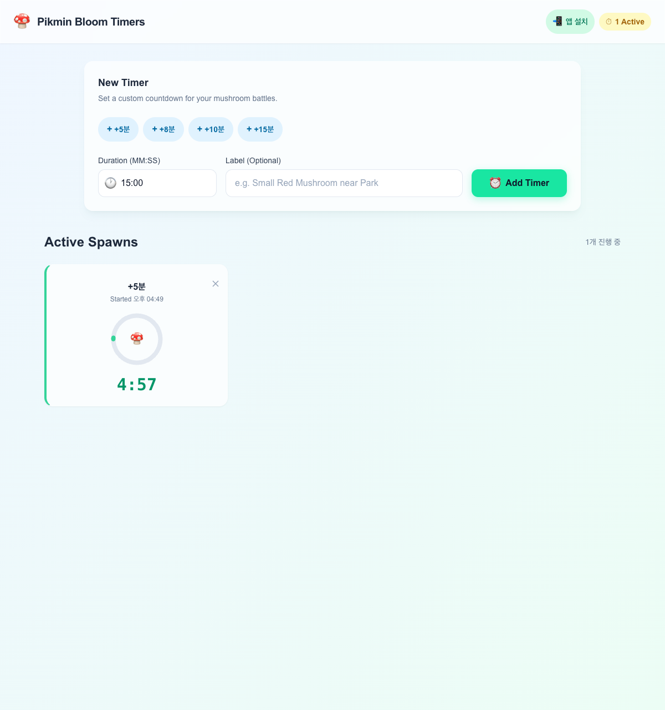

# 피크민 버섯 타이머

피크민 블룸(Pikmin Bloom)에서 버섯 챌린지를 끝내면 다음 리스폰까지 대기 시간이 생긴다.
그 시간을 한눈에 관리하려고 만든 멀티 타이머 웹앱이다.
최대 8개를 동시에 돌리고, 끝나면 소리랑 알림으로 알려준다.

> **Live Demo** : [pikmin-timer.kwag93.workers.dev](https://pikmin-timer.kwag93.workers.dev)



---

## 주요 기능

- **멀티 타이머** — 최대 8개를 동시에 실행하고 개별 관리
- **빠른 추가** — +5분, +8분, +10분, +15분 프리셋 버튼으로 원클릭 등록
- **커스텀 시간** — MM:SS 형식으로 자유롭게 설정
- **라벨 지정** — "공원 옆 빨간 버섯" 같은 메모를 붙여둘 수 있음
- **원형 프로그레스** — SVG 원형 바로 남은 시간을 직관적으로 확인
- **Phase 색상** — 안전(초록) → 주의(노랑) → 위험(주황) → 완료(빨강)
- **알림** — Web Notification + Web Audio로 완료 시점에 이중 알림
- **백그라운드 보정** — 다른 탭에 있다 돌아와도 정확히 동작
- **새로고침 유지** — LocalStorage에 저장해서 새로고침해도 타이머가 살아있음
- **PWA** — 홈 화면에 추가하면 앱처럼 쓸 수 있음

---

## 스크린샷

| 빈 상태 | 타이머 실행 중 |
|:---:|:---:|
|  |  |

---

## 시작하기

### 필수 환경

- **Node.js** 20 이상
- **pnpm** 9 이상

```bash
node --version   # v20.x.x 이상 확인
pnpm --version   # 9.x.x 이상 확인
```

pnpm이 없다면:

```bash
corepack enable
corepack prepare pnpm@9 --activate
```

### 설치 및 실행

```bash
# 1. 저장소 클론
git clone https://github.com/kwag93/pikmin-timer.git
cd pikmin-timer

# 2. 의존성 설치
pnpm install

# 3. 개발 서버 실행
pnpm dev
```

브라우저에서 `http://localhost:5173`으로 접속하면 된다.

### 빌드

```bash
# 프로덕션 빌드
pnpm build

# 빌드 결과 미리보기
pnpm preview
```

`dist/` 폴더에 정적 파일이 생성된다.

---

## 기술 스택

| 분류 | 기술 |
|------|------|
| 프레임워크 | React 18 + TypeScript (strict) |
| 빌드 | Vite 6 |
| 스타일 | TailwindCSS 3 + CSS Variables (Pikmin 테마) |
| 애니메이션 | Framer Motion |
| PWA | vite-plugin-pwa (Workbox) |
| 배포 | Cloudflare Workers |

---

## 프로젝트 구조

```
src/
├── components/       # UI 컴포넌트
│   ├── AppHeader.tsx     # 헤더 + 활성 타이머 배지
│   ├── TimerForm.tsx     # 타이머 생성 폼
│   ├── TimerGrid.tsx     # 타이머 카드 그리드
│   ├── TimerCard.tsx     # 개별 타이머 카드
│   ├── ProgressArc.tsx   # SVG 원형 프로그레스
│   └── Background.tsx    # 배경 그라디언트
├── hooks/            # 커스텀 훅
│   ├── useTimerManager.ts   # 타이머 CRUD + 상태 관리
│   ├── useNotification.ts   # Web Notification
│   └── useTimerAlerts.ts    # 완료 감지 + 알림 스케줄링
├── lib/              # 유틸리티
│   ├── timerState.ts        # Phase 판정 로직
│   ├── motionVariants.ts    # Framer Motion 프리셋
│   ├── presets.ts           # 빠른 추가 프리셋 데이터
│   ├── sound.ts             # Web Audio API 알림음
│   └── utils.ts             # cn() 등 공통 유틸
├── types/            # 타입 정의
│   └── timer.ts
├── App.tsx           # 메인 페이지
├── main.tsx          # React 엔트리포인트
└── globals.css       # Pikmin 테마 토큰 + Tailwind
```

---

## 사용 방법

### 타이머 추가

1. 상단 **프리셋 버튼**(+5분, +8분, +10분, +15분)을 누르면 바로 타이머가 시작된다.
2. 직접 시간을 정하고 싶으면 **Duration** 필드에 `MM:SS` 형식으로 입력한다.
3. **Label** 필드에 위치나 버섯 종류를 메모해둘 수 있다 (선택).
4. **Add Timer** 버튼을 누르면 카운트다운이 시작된다.

### 타이머 관리

- 각 카드의 **X 버튼**으로 삭제할 수 있다.
- 남은 시간에 따라 카드 색상이 알아서 바뀐다.
  - **초록** (3분 초과) — 여유 있음
  - **노랑** (3분 이하) — 곧 끝남
  - **주황** (1분 이하) — 거의 다 됨
  - **빨강** (완료) — 리스폰!

### 알림

처음 사용할 때 브라우저 알림 권한을 허용해두면 타이머가 끝날 때 푸시 알림과 소리로 알려준다.
다른 탭에서 작업 중이어도 알림이 온다.

### 앱 설치 (PWA)

헤더 우측 **앱 설치** 버튼이나 브라우저의 "홈 화면에 추가" 기능으로 설치할 수 있다.
설치하면 전체 화면에서 앱처럼 쓸 수 있다.

---

## 배포

Cloudflare Workers에 연결되어 있어서 `main` 브랜치에 push하면 자동으로 빌드 + 배포된다.

```bash
# 수동 배포 (wrangler CLI 필요)
pnpm build
npx wrangler deploy
```

---

## 라이선스

MIT

---

<p align="center">
  Made with 🍄 for Pikmin Bloom players
</p>
